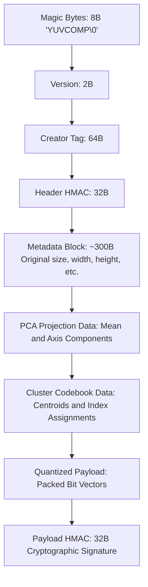

# Vector-Based Semantic File Compressor

[](https://en.cppreference.com/w/cpp/compiler_support/17)
[](https://cmake.org)
[](#compression-performance-and-lossy-reconstruction)
[](#cryptographic-security)


---

## Overview

**Vector Based Compressor** is a high-performance semantic and structural compression engine written in modern C++. 

Unlike traditional compression utilities (such as ZIP, DEFLATE, or LZW) which rely purely on statistical redundancy and repeated byte patterns, YVCompressor utilizes **lossy semantic compression**. By treating parts of an image as points in a high-dimensional vector space, YVC shifts the compression paradigm from syntactic encoding to **vector-space approximation**. 

Through a combined pipeline of Patch Vectorization, Principal Component Analysis (PCA), K-Means Clustering, Delta Encoding, and Scalar Quantization, YVCompressor achieves an **average compression ratio of 6.8x** (equivalent to an **~85.3% reduction in file size**) while maintaining high structural fidelity and reconstruction quality.

---

## How Lossy Vector-Based Compression Works

The core philosophy of YVCompressor is that adjacent pixels and recurring patterns within an image contain heavy semantic redundancy. By representing images as collections of vectors, YVC can identify and merge similar visual features.

### 1. Image Patch Vectorization
* **Chunky Parsing**: The input image (PNG or JPG) is parsed and divided into non-overlapping grids of $N \times N$ pixels (typically $16 \times 16$).
* **Vector Conversion**: A single $16 \times 16$ RGB patch contains $16 \times 16 \times 3 = 768$ color channels. This patch is flattened into a single $768$-dimensional vector where each dimension represents a normalized float value ($0.0$ to $1.0$).

### 2. K-Means Vector Quantization (VQ)
* Instead of storing every individual vector, YVCompressor groups similar vectors using a custom **K-Means Clustering** implementation.
* The vector space is partitioned into $K$ clusters (default: 64).
* The algorithm saves the $K$ centroid vectors (which act as a codebook) and a list of index assignments (which patch maps to which centroid). To minimize visual artifacts, the differences (residual vectors) can optionally be encoded and stored.

### 3. Dimensionality Reduction (PCA)
* For high-resolution files, the dimensional density is reduced using **Principal Component Analysis (PCA)**. 
* By projecting the vectors onto the primary axes of maximum variance, YVC reduces the dimensions of each patch from 768 to a much smaller target subspace (e.g., 32 or 64 principal components).

### 4. Delta Encoding
* Neighboring patches in an image often share similar backgrounds or color gradients.
* YVC performs **Delta Encoding** on subsequent patch vectors, storing only the difference vector ($\Delta = V_{i} - V_{i-1}$) instead of absolute vector coordinates, which significantly shrinks the entropy of the dataset.

### 5. Scalar Quantization
* The final floating-point representations are scaled and converted into low-bit integers (e.g., 8-bit or 4-bit) through a custom range-based quantizer. This converts 32-bit floats into compact 8-bit bytes based on the dynamic ranges (`min_val` and `max_val`) calculated per dimension.

---

## Compression Performance and Lossy Reconstruction

YVCompressor is optimized to balance file size reduction against visual output quality.

* **Average Compression Ratio**: **6.8x** (files are compressed to roughly **14.7%** of their original size).
* **Fidelity Assessment**: During decompression, YVC measures and outputs industry-standard quality metrics comparing the original image with the reconstructed image:
  * **PSNR (Peak Signal-to-Noise Ratio)**: Measures logarithmic ratio between the maximum possible signal power and the corrupting noise (higher is better, typically $>30\text{ dB}$ for good quality).
  * **SSIM (Structural Similarity Index)**: Measures structural degradation based on human visual perception (scales from $0.0$ to $1.0$, where $1.0$ is identical).

---

## Cryptographic Security

YVCompressor features a proprietary binary container format designed to prevent unauthorized viewing or tampering.

* **Signature Authentication**: Every `.yvc` file contains a header with cryptographic magic bytes (`YUVCOMP\0`).
* **Dual HMAC-SHA256 Protection**:
  1. A **Header HMAC** secures the metadata table (dimensions, compression configuration, timestamps).
  2. A **Payload HMAC** secures the actual quantized vector data.
* **Integrity Validation**: If the file is altered or tampered with by even a single bit, the decompression engine detects the mismatch and aborts, ensuring only the official YVC application can access the content.
* **Creator Branding**: A custom signature up to 64 bytes (e.g. `--creator "Your Name"`) is embedded directly in the authenticated header.

---

## Build and Setup

### Prerequisites
* **CMake**: Version 3.16 or newer.
* **Compiler**: A C++17 compatible compiler:
  * MSVC 2019+ (Windows)
  * GCC 7+ (Linux)
  * Clang 5+ (macOS)
* **Git**: Required by CMake to fetch `stb_image` dependencies automatically.

### Easy Build (Windows)
Double-click or run the provided batch file in PowerShell/CMD:
```bash
.\build.bat
```

### Manual Build (Cross-Platform)
```bash
mkdir build
cd build
cmake .. -DCMAKE_BUILD_TYPE=Release
cmake --build . --config Release
```
The compiled executable `yvc` (or `yvc.exe`) will be generated inside the `build` directory.

---

## CLI Usage Guide

The engine supports three main commands: `compress`, `decompress`, and `info`.

### 1. Compression
Compress an image into a secure `.yvc` archive:
```bash
yvc compress input.png -o output.yvc --creator "Your Name" --clusters 64 --bits 8
```

### 2. Decompression
Reconstruct the compressed file back into a standard image:
```bash
yvc decompress output.yvc -o restored.png
```

### 3. File Metadata Inspection
Read and verify the header information, creator name, and parameters without decompressing:
```bash
yvc info output.yvc
```

### Command Options Table

| Flag | Parameter | Description | Default |
|---|---|---|---|
| `--creator` | `<string>` | Custom branding metadata signature (max 64 bytes) | `"YVC Compressor"` |
| `--patch` | `<int>` | Patch size in pixels (e.g., 8, 16, 32) | `16` |
| `--clusters` | `<int>` | Number of K-Means centroids for vector codebook | `64` |
| `--bits` | `<int>` | Target bits for scalar quantization (typically 8) | `8` |
| `--pca` | `<int>` | Target dimensions for PCA reduction (0 disables PCA) | `0` |
| `--no-delta` | — | Disables delta vector correlation encoding | Active by default |
| `--no-cluster`| — | Disables K-Means clustering (stores raw vector grid) | Active by default |

---

## Repository Structure

```
Compressor/
├── CMakeLists.txt          # Root CMake build configuration
├── build.bat               # Automated Windows generator & build script
├── include/yvc/
│   ├── types.h             # Core data structures (ImagePatch, PCAResult, etc.)
│   ├── crypto.h            # Cryptographic utilities (SHA-256 & HMAC)
│   ├── parser.h            # High-level file parser (calls stb)
│   ├── chunker.h           # Grid patching & patch merging algorithms
│   ├── vectorizer.h        # Pixels-to-vector & vector-to-pixels pipelines
│   ├── compressor.h        # Quantization, K-Means, Delta, and PCA layers
│   ├── format.h            # Encoder and Decoder for .yvc container
│   └── reconstructor.h     # Reconstitution logic and PSNR/SSIM evaluation
└── src/
    ├── main.cpp             # CLI Parser and application entry point
    ├── crypto.cpp           # SHA-256 hashing and HMAC logic
    ├── parser.cpp           # Image ingestion/extraction via stb_image
    ├── chunker.cpp          # Grid decomposition and reassembly
    ├── vectorizer.cpp       # Vector transformations
    ├── compressor.cpp       # Inner algorithms: PCA, K-Means, Delta, Quantization
    ├── format.cpp           # Byte-stream serialization & HMAC generation
    ├── reconstructor.cpp    # Image reassembly and metric assessment
    └── stb_impl.cpp         # Single compilation unit for stb headers
```

---

## Binary Layout of `.yvc` Files

When YVCompressor encodes data, it serializes it into the following structured binary stream:



| Section | Size (Bytes) | Description |
|---|---|---|
| **Magic Bytes** | 8 | File identification bytes `YUVCOMP\0` |
| **Format Version** | 2 | API Versioning identification |
| **Creator Tag** | 64 | Text metadata tag for creator branding |
| **Header HMAC** | 32 | Cryptographic SHA-256 HMAC protecting the metadata |
| **Metadata Block** | ~300 | Dimensions, channel counts, patch config, timestamp |
| **PCA Components** | Variable | Principal components and mean vectors (if PCA enabled) |
| **Cluster Codebook**| Variable | Quantized Centroids and assignment indices (if enabled) |
| **Quantized Payload**| Variable | Normalized, quantized vector difference payload |
| **Payload HMAC** | 32 | SHA-256 HMAC of the entire compressed payload |
